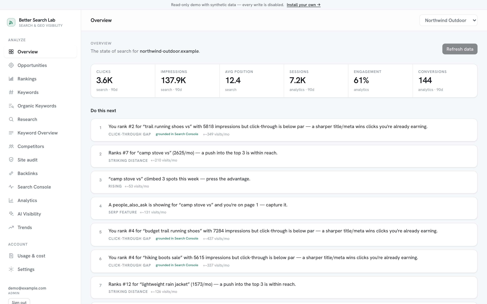
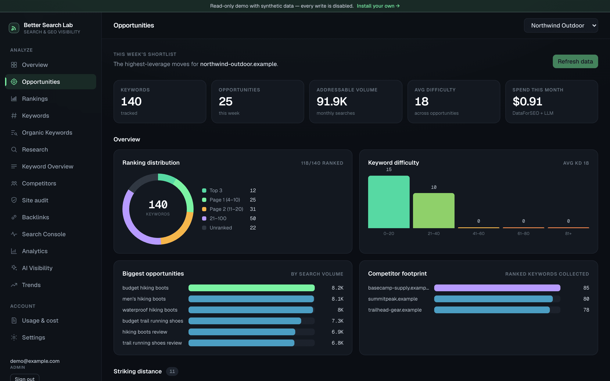

# Better Search Lab

Canonical repository: [gitlab.com/betterbrainlab/better-search-lab](https://gitlab.com/betterbrainlab/better-search-lab). The copy at [github.com/Heshamus/better-search-lab](https://github.com/Heshamus/better-search-lab) is a read-only mirror; issues and merge requests live on GitLab.

Self-hosted SEO and AI-search visibility for people who run their own sites: rank tracking, keyword research, competitor gaps, backlinks, site audits, Search Console and Analytics in one place, a weekly **opportunity engine** that turns all of it into a short list of things to do, and an **MCP server** so your coding agent can read the same data.



Powered by the [DataForSEO](https://dataforseo.com) API on a pay-as-you-go basis — no credit system, an honest in-app meter instead. AGPL-3.0 licensed; run it on a laptop, a VPS, or Railway.

## Try it in five minutes

Docker and curl are the only requirements:

```bash
curl -fsSL https://gitlab.com/betterbrainlab/better-search-lab/-/raw/main/install.sh | sh
```

This creates a `better-search-lab` folder, generates a secret, starts Postgres, the app and the worker, and prints the address. Open `http://localhost:3000` — on first run it redirects to `/setup`, which creates your admin account, connects DataForSEO (a $5 balance is plenty to start), profiles your site, suggests competitors, and builds the first picture. Active time: about five minutes; DataForSEO spend for a 150-keyword site: about $0.37. Everything else — an AI assistant, Google, email, Reddit — is optional and lives under **Settings → Integrations**.

Want to look before you connect anything? Add `-s -- --demo` to the command above (`… | sh -s -- --demo`) for a read-only demo with two synthetic sites and ninety days of history (`DEMO_MODE`).

Prefer the source? Clone the repository, copy `.env.example` to `.env`, set `AUTH_SECRET`, then `docker compose up -d --build`; [docs/install.md](docs/install.md) has the exact lines.

## What it does

| Area | What you get |
|---|---|
| **Overview** | Search Console and Analytics headline, "do this next", health tiles |
| **Opportunities** | The weekly shortlist: striking distance, decay, momentum, gaps, SERP features, cannibalization, CTR gaps — scored, explained, actionable |
| **Rankings & keywords** | Daily positions with history, SERP features you own, tracked-keyword management, bulk keyword overview |
| **Competitors** | Up to five per site, suggested from real overlap; their keywords, top pages, and the gaps you are missing |
| **Backlinks, audit, organic** | DataForSEO backlink snapshots with trends; an on-page audit from our own crawler (free); organic keywords |
| **AI visibility** | Weekly scans of Perplexity, ChatGPT and Gemini: are you named, are you cited, who is |
| **Reddit conversations** | Threads worth joining, judged for fit and drafted with citations |
| **MCP** | `npx @better-search-lab/mcp` gives Claude Code (or any MCP client) read-only tools over your data |



## Install

- **One command** (recommended): the installer above. `docs/install.md` covers updates, volumes, reverse proxies, and the worker.
- **Railway**: the repo ships `railway.json` (web) and `railway.worker.json` (worker).
- **Bare metal**: Node 22, pnpm, Postgres 16; `pnpm install && pnpm db:migrate && pnpm build && pnpm start`, plus `pnpm worker`.

Only `DATABASE_URL` and `AUTH_SECRET` are required. Every integration is configured in the app; each can also be set by environment variable, and the environment wins — see [docs/configuration.md](docs/configuration.md).

## Costs

DataForSEO bills per request; the in-app **Usage** page shows exactly what was spent, by day and endpoint. Typical numbers: a rank check is $0.002 per keyword per refresh, keyword research and competitor calls are about $0.012 each, a backlinks refresh about $0.06. The first build of a 150-keyword site is about $0.37; a weekly refresh of the same site about $0.34. Details and how to keep it low: [docs/costs.md](docs/costs.md).

## MCP

Mint a token under **Settings → MCP**, then register the server with your agent:

```json
{ "mcpServers": { "better-search-lab": { "command": "npx", "args": ["-y", "@better-search-lab/mcp"], "env": { "BSL_URL": "https://your-install.example.com", "BSL_TOKEN": "bsl_…" } } } }
```

Eleven read-only tools — projects, opportunities, gaps, competitors, audit, backlinks, Search Console, Analytics, AI visibility, Reddit conversations, keyword overview. See [docs/mcp.md](docs/mcp.md).

## How it works

Next.js 15 (App Router) + Postgres, one image for the web app and a worker. Pages are server components that read the database; every mutation is a session-guarded API route; long jobs run in the worker and report live progress. Integration secrets are encrypted at rest. [docs/architecture.md](docs/architecture.md) has the map.

## Contributing

Issues and merge requests are welcome on GitLab — start with [CONTRIBUTING.md](CONTRIBUTING.md). Security reports: [SECURITY.md](SECURITY.md). Every change ships with tests; the suite runs on an in-memory Postgres and never touches the network.

## License

[AGPL-3.0-only](LICENSE). You can run, modify and self-host it freely; if you offer it to others as a service, share your changes.
